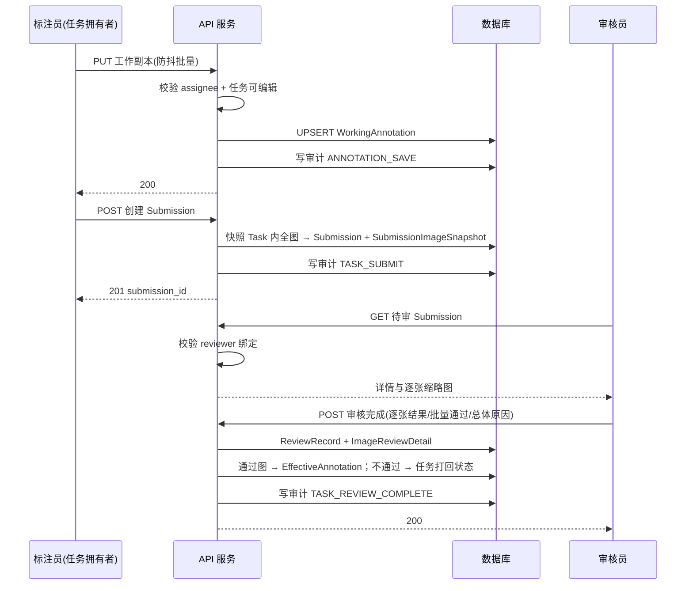
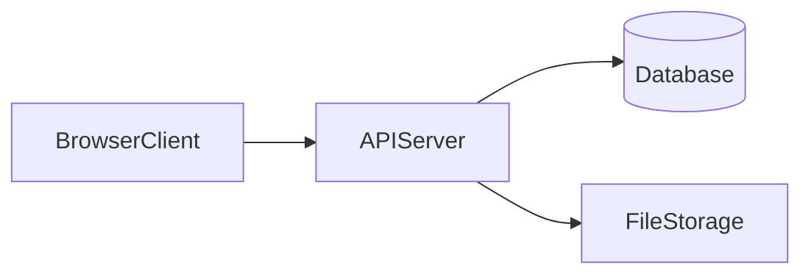
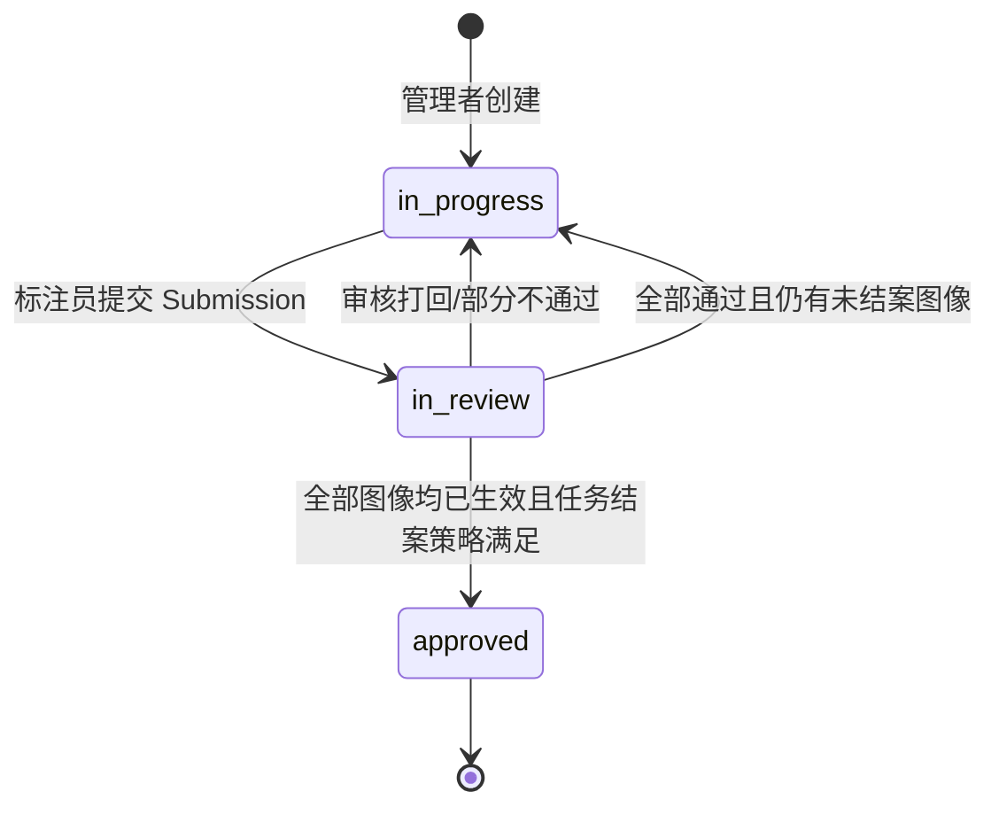

# 图像检测协同标注平台 — 软件描述文档（生成提示）

> **文档定位**：本文档作为产品需求、系统架构与实现约束的「单一事实来源（SSOT）」，可直接作为代码生成工具（如 IDE Agent、脚手架生成器）的输入提示，用于生成前后端工程、数据库 Schema、接口契约与测试用例。  
> **版本**：1.13  
> **日期**：2026-04-22  
> **修订**：1.13 对齐当前实现：任务删除权限改为 `admin` 与 `manager` 均可执行；`approved` 任务删除为软删除（`deleted_at`）并返回 200；重复提交待审错误码统一为 `TASK_IN_REVIEW`；认证接口不包含 `/refresh`；审计字段与动作枚举对齐当前表结构与后端动作名；数据库部署建议改为 MySQL 8（Docker）+ SQLite（本地开发回退）；补充导出下载接口 `/exports/{filename}` 并修正文档中的导出时序。1.12 对齐实现：XML 落地时机调整为“审核完成时按通过图写入”，打回图不写 XML；补充“无默认类别 + 画框后补类别 + 未分类框禁止提交（`UNCLASSIFIED_BOXES`）”；补充管理者/管理员流程看板（当前状态、当前责任人、下一步）；补充审核台显示提交者信息、专注评审布局与批量通过/批量打回二次确认；补充任务样本栏行式滚动列表与专注模式进度显示；补充管理后台审计列表降噪与固定高度滚动展示。1.11 补充标注员提交审核后自动在图像同目录写入 XML 标注文件（Pascal VOC 风格）及部署写权限要求；1.10 补充系统管理员可禁用与删除其他账号（禁止删自己、有关联业务数据的账号禁止硬删）、用户删除接口与验收条款；1.9 补充系统管理员删除未完成任务的权限、接口、审计与验收条款；1.8 补充管理员前端创建账号、用户角色/启用状态维护、任务分发按文件夹进入目录后全选/取消当前图片，以及对应验收条款；1.7 补充标注页专注标注模式、画布放大策略、专注模式下类别前置，以及审核示例标注可由标注员单独显隐；1.6 补充审核台显示提交标注框、审核员可绘制打回示例标注且示例仅作为审核反馈不进入工作副本/生效层；1.5 补充标注编辑器快捷键基线、快捷键帮助展示、输入态防误触发与对应验收条款；1.4 补充空标注/负样本、源图像跨任务边界、任务重分配、存储目录浏览 API、EXIF 坐标统一、防路径穿越，以及对应的数据模型、接口与验收条款。  
> **读者**：产品经理、架构师、前后端工程师、测试工程师、运维工程师

---

## 0. 面向代码生成工具的指令摘要（必读）

生成或实现本系统时，**必须**同时满足下列条款；若与下文其他章节表述有歧义，以**安全性、权限不可绕过、审计可追溯**为准。

| # | 硬性要求 | 验收要点 |
|---|----------|----------|
| G1 | **LabelImg 级基础能力** | 矩形框检测标注、类别与颜色、画布缩放平移、常用快捷键（键位基线见 §4.7）、上一张/下一张、专注标注模式；坐标与导出格式见第 4、8 节。 |
| G2 | **任务分发** | **管理者**可从服务端挂载的**某文件夹**下列举图片并**多选**纳入任务；支持进入文件夹后对当前文件夹图片全选/取消全选、清空全部已选；任务绑定**唯一标注责任人（任务拥有者）**与**审核人（首版建议一名）**。 |
| G3 | **非拥有者“无效标注”** | **非任务拥有者**对任务内图片**不得**产生**服务端承认的标注持久化**（工作副本写入拒绝）；前端不得提供可误导的“已保存”成功态；**403 + 无写入**。 |
| G4 | **提交与审核闭环** | 标注员提交 → 审核员可**逐张**通过/不通过，或**批量通过整单** → **通过部分**合并为**生效标注**；不通过则**打回**，支持**总体原因**、**单张原因**与可选**审核示例标注**。 |
| G5 | **前后端 + 数据库** | 浏览器 **SPA 前端**；**REST API** 后端；**关系型数据库**持久化任务、标注版本、审核记录与**审计日志**。 |
| G6 | **审计** | 关键写操作记录操作者、目标、时间、结果与摘要；见第 9 节。 |
| G7 | **部署形态** | **服务端运行于 Linux**（物理机/虚拟机/容器均可）；**标注端**通过现代浏览器访问同一 URL，**Windows / macOS / Linux 客户端均可**，无需在 Windows 上部署后端（本地开发除外）。 |
| G8 | **空标注是合法结果** | 支持将图片显式标记为**无目标 / 空标注**；该状态需有明确字段或状态位，不得与“尚未开始”混淆；审核通过后可计入完成与导出。 |
| G9 | **源图排他分发** | 同一源图在未完成任务中只能被一个任务占用；若源图已处于 `draft` / `in_progress` / `submitted` / `in_review` / `rejected` 等未完成任务，创建或追加到其它任务必须返回 409，避免多个标注员同时处理同一图片。 |
| G10 | **管理角色删除任务** | `admin` 与 `manager` 均可删除任务；未完成任务执行流程数据物理删除并释放源图占用；`approved` 任务执行软删除（写 `deleted_at`）并写入审计；删除均不得移除原始图片文件。 |
| G11 | **审核完成后按通过图落地 XML** | 审核员完成审核时，系统仅为 `passed` 的图像写入同名 `.xml`（Pascal VOC 风格）到图像同目录；`failed` 图像不得写入 XML。写入失败应阻止本次审核完成并返回明确错误。 |

**建议交付物（供生成器拆分任务）**：OpenAPI 3 规范、SQL 迁移脚本（或 ORM 模型）、前端路由与页面骨架、RBAC 中间件、审核状态机单测、权限矩阵 E2E 用例。

### 0.1 最近实现更新摘要（2026-04-20）

1. **源图排他分发**：同一源图在 `draft` / `in_progress` / `submitted` / `in_review` / `rejected` 等未完成任务中只能被一个任务占用。创建任务或追加图片时，若目标图片已被其它未完成任务占用，服务端必须返回 **409** `SOURCE_IMAGE_ALREADY_ASSIGNED`；若同一次请求内重复选择同一图片，返回 **400** `DUPLICATE_TASK_IMAGE`。该规则用于避免同一组图片被分发给不同标注员后产生互相覆盖或审核口径冲突。
2. **管理角色删除任务**：`admin` 与 `manager` 均可删除任务。对未完成任务，删除操作会清理任务流程数据（任务图片关联、工作副本、提交快照、审核记录、生效标注与任务级类别），并释放源图占用；对 `approved` 任务，执行软删除（`deleted_at`）并从任务查询中隐藏。两类删除都不得删除原始图片文件，也不得删除 `SourceImage` 源图登记；成功删除必须写入审计日志 `TASK_DELETE`。
3. **管理员禁用与删除其他账号**：系统管理员可在前端维护账号启用状态，并可删除无业务关联账号。禁止删除当前登录管理员自己；若账号已关联任务、提交、审核或标注更新记录，服务端必须返回 **409** `USER_HAS_ACTIVITY` 并引导先禁用而非硬删。用户删除成功后须写审计日志 `USER_DELETE`。
4. **XML 落地时机调整**：XML 不再在“提交审核”时写入；改为“审核完成”时按逐张决策落地。仅 `passed` 图像写入 `.xml`，`failed` 图像不写入，避免打回样本产生误导性产物。若写入失败，`review/complete` 返回 `XML_WRITE_FAILED`，Submission 保持未完成状态。
5. **无默认类别与补类闭环**：任务创建默认可不带类别；标注员或审核员绘制新框后需通过弹窗选择已有类别或输入新类别。存在未分类框时，提交审核返回 **400** `UNCLASSIFIED_BOXES`。
6. **流程看板可视化**：管理者/管理员在仪表盘与任务页可看到流程看板（当前状态、当前责任角色/责任人、标注员、审核员、创建人、下一步动作），用于快速判断卡点。
7. **样本栏与专注模式优化**：标注页与审核台样本区均采用固定尺寸行式列表（可滚动），支持当前样本高亮与“当前样本名 + 当前张/总张”显示；专注模式下仍保留该进度信息。
8. **审核台可用性增强**：审核台显示提交者与提交时间；“批量通过”“批量打回”均要求二次确认；专注评审模式下保留必要操作（示例标注、图片原因、总体意见、样本列表）。
9. **审计视图降噪**：管理后台“最近审计”默认过滤低价值高频事件（如登录/登出/自动保存），并采用固定高度表格容器滚动展示，避免页面无限拉长。

---

## 1. 文档信息与术语

### 1.1 读者与使用方式

| 角色 | 本文档的使用方式 |
|------|------------------|
| 产品 | 核对功能范围、角色与流程是否满足业务 |
| 研发 | 按数据模型、API、状态机与权限规则实现 |
| 测试 | 按验收标准与用例矩阵编写自动化与手工用例 |
| 运维 | 按部署与非功能需求规划环境、备份与监控 |

### 1.2 术语表

| 术语 | 定义 |
|------|------|
| 图像 / 样本 | 任务中被分配的一张待标注图片，由存储路径或对象键唯一标识 |
| 源图像（SourceImage / MediaAsset） | 存储中的原始图片资源，可由文件路径或对象键定位；首版默认对未完成任务执行排他占用，避免同一源图被并行分发给不同标注员 |
| 标注框 | 目标检测中常用的轴对齐矩形框，含位置、尺寸、类别等信息 |
| 类别 | 检测目标的语义标签；在任务或全局范围内维护类别表 |
| 任务（AnnotationTask） | 管理者创建的工作单元，包含若干图像、一名标注责任人、可选一名或多名的审核责任人 |
| 任务拥有者 | 被指定为某任务**标注责任人**的用户；仅该用户对任务内图像拥有**有效编辑权** |
| 工作副本（Working Copy） | 标注员本地编辑中的、尚未经审核生效的标注数据 |
| 空标注 / 无目标（No Object） | 显式表示当前图片确认不存在需标注目标；必须通过专门字段或状态位表达，**不能**仅依赖 `boxes = []` 推断 |
| 提交（Submission） | 标注员将当前工作副本冻结为一次不可变快照并送审的行为及该快照实体 |
| 审核单 / 审核会话 | 针对某次 Submission 的审核过程，可包含逐张与批量操作 |
| 生效版本（Effective Annotation） | 经审核通过后，对某张图像当前「正式有效」的标注集合 |
| 打回 | 审核未通过，任务退回标注员修改；可附带总体原因与逐张原因 |
| 审计日志 | 记录谁在何时对何对象做了何操作及前后状态摘要的系统记录 |

### 1.3 原始需求与章节映射（溯源）

以下将用户提出的能力点映射到本文档章节，便于评审与测试用例追溯。

| 用户需求要点 | 主要覆盖章节 |
|--------------|--------------|
| 具备 LabelImg 的基本标注能力（画框、类别、导航等） | §4 |
| 管理者向各账号分发任务（指定文件夹下部分图片、当前文件夹全选/取消） | §6.2、§8.1、§11.3 |
| 可指定审核人；任务拥有者与非拥有者权限区分 | §5、§6、§11.4 |
| 非本任务标注责任人（非任务拥有者）不得对该任务内图片写入工作副本；服务端拒绝非授权持久化 | §5.3、§6.4.1、§14.1 |
| 标注完成后提交审核；审核人可逐张或批量通过 | §6.4、§6.5、§11.5 |
| 通过后修改生效；不通过可写总体原因或单张原因并打回 | §6.5、§7 |
| 管理员可在前端创建账号、维护账号角色与启用状态 | §5.4、§11.2、§12、§14.1 |
| 管理员可删除还未完成的任务，释放源图占用但不删除原图文件 | §5.3、§6.2.2、§8.3、§11.3、§14.1 |
| 前端操作与管理 + 后端数据库；记录谁修改、详尽变更信息 | §8、§9、§10 |
| 服务端 Linux 部署；客户端跨平台（浏览器在 Windows 打开即可标注） | §10.3、§13.4 |

---

## 2. 背景与目标

### 2.1 问题陈述

开源工具 **LabelImg** 提供了良好的单机图像检测标注体验，但在多人协作场景中存在明显缺口：无法按任务隔离数据与权限、无法指定审核流程、无法阻止非责任人误标、也缺乏对「谁改了什么」的集中审计。企业或团队需要一套 **Web 化、可部署在自有服务器（以 Linux 为主）** 的协同标注平台。

### 2.2 产品目标

1. **对标 LabelImg 的基础体验**：矩形框标注、类别管理、便捷的画布操作与导航、常用格式的导入导出。  
2. **协同与管控**：由管理者分发任务（指定文件夹下的部分图片）、绑定标注员与审核员；**非任务拥有者无法对任务内图片产生生效标注**（前后端双重校验）。  
3. **审核闭环**：标注员提交 → 审核员可逐张通过/不通过，或批量通过 → 通过后变更正式生效；不通过则打回并允许填写**总体原因**与**单张原因**。  
4. **可追溯**：后端持久化任务、版本、提交与审核结论；**审计日志**记录关键操作与责任主体。  
5. **部署与访问**：服务端以 **Linux** 为主要运行环境；客户端通过现代浏览器访问即可，从而在 **Windows / macOS / Linux** 上均可进行标注与管理，无需强制安装桌面客户端（首版不承诺离线桌面版）。

### 2.3 用户故事（摘要）

- **US-1（管理者）**：作为管理者，我希望从已挂载的目录中选择某个文件夹并勾选多张图片生成任务，指定一名标注员与一名审核员，以便分工明确、可追溯。  
- **US-2（标注员）**：作为任务拥有者，我希望在浏览器中像 LabelImg 一样画框并自动保存到服务器，仅在审核通过后我的标注才对「正式数据」生效。  
- **US-3（其他用户）**：作为非本任务责任人，即使我知道图片 URL，我也不应能保存或提交该任务的标注。  
- **US-4（审核员）**：作为审核员，我希望对待审提交逐张通过/不通过或一键批量通过；打回时必须能写总体原因，并对未通过的单张写原因。  
- **US-5（管理员）**：作为系统管理员，我希望在前端管理后台创建账号、分配或调整角色、启用/禁用账号，以便不依赖命令行完成日常账号管理。  
- **US-6（管理员）**：作为系统管理员，我希望查询谁在何时修改了用户、任务、标注与审核结论，以满足审计与排错。
- **US-7（管理员）**：作为系统管理员，我希望能删除还未完成且误建或不再需要的任务，并释放其中图片的分发占用，但不误删服务器上的原始图片文件。

---

## 3. 范围

### 3.1 范围内（In Scope）— 首版必须交付

- 目标检测：**轴对齐矩形框**标注；类别列表的增删改查。  
- 用户与认证：注册/登录（是否开放注册可由配置项控制）、会话或令牌机制；管理员可通过前端创建用户、修改显示名、维护角色与启用状态。  
- 角色与权限：**系统管理员、管理者、标注员、审核员**；见第 5 节。  
- 任务：从存储根路径下列举文件夹、多选图片创建任务；支持进入文件夹后全选/取消当前文件夹图片、清空全部已选；指定标注员、审核员；可选截止时间、优先级、说明。  
- 管理维护：系统管理员可删除还未完成的任务；删除任务只清理任务流程数据，不删除源图片文件。  
- 存储浏览：管理者可浏览配置的**只读**存储根目录，按目录、文件名、扩展名筛选待纳入任务的图片。  
- 标注编辑：仅任务拥有者可保存**工作副本**；他人无编辑权。  
- 负样本：支持将单图显式标记为**无目标 / 空标注**，并参与提交、审核、导出与完成统计。  
- 提交与审核：生成 Submission；审核员逐张通过/不通过、批量通过；打回与原因。  
- **部分通过**：部分图像审核通过后锁定为生效版本，未通过部分退回修改（见第 7 节）。  
- 数据与版本：工作副本、提交快照、生效版本三层模型（见第 8 节）。  
- 审计日志：见第 9 节。  
- 导入导出：至少一种业界常用格式 **必选**（建议 **YOLO** 或 **Pascal VOC** 二选一作为首版必交付）；其余格式与平台原生 JSON 可作为首版或紧跟迭代。

### 3.2 范围外（Out of Scope）— 首版不实现或仅预留扩展点

- 实例分割、语义分割、像素级标注。  
- 视频目标跟踪、连续帧关联。  
- 原生桌面客户端（Electron 等）；若未来需要，可作为独立项目引用同一后端 API。  
- 与外部 MLOps 平台、训练流水线的深度集成（首版仅文件导入导出即可）。  
- 多人同时编辑**同一任务同一图像**的实时协同冲突合并（首版约束见第 8 节）。  
- 「审核员代标」：首版 **不提供**；审核员不能修改标注内容，仅能通过/打回（减少权限与审计复杂度）。

### 3.3 首版交付边界（给代码生成器的「完成定义」）

首版被认为**可交付**，当且仅当同时满足：

1. 管理者可创建任务并绑定存储中的多张图片、指定标注员与审核员。  
2. 标注员（且仅为 `assignee_user_id`）可读写工作副本；其他用户对该任务的写入类 API 均返回 403。  
3. 存在完整提交 → 审核（逐张/批量）→ 生效/打回 闭环，且数据库中可查询每次提交的快照与审核明细。  
4. 管理者可通过只读目录浏览接口枚举服务端图片；接口强制根路径白名单与路径规范化。  
5. “无目标 / 空标注”图片可被显式提交、审核通过并纳入导出与任务完成统计。  
6. 同一源图像在未完成任务中不可重复分发；若已被未完成任务占用，再次创建或追加任务应返回 409，防止多个标注员并行处理同一源图。  
7. 审计日志覆盖登录、任务变更、标注保存、提交、审核、导出等关键事件。  
8. 提供一种标准检测格式（YOLO 或 VOC）的导入或导出至少一端可用（建议导出必达）。  
9. 提供可在 Linux 上启动的部署方式（如 Docker Compose）及环境变量说明。

---

## 4. 对标 LabelImg 的基本功能

以下功能用于约束**标注编辑器**的交互与能力，实现上可采用 Canvas / SVG / WebGL 等技术，技术选型可替换，但**用户可见能力**应接近 LabelImg。

### 4.1 工作区与类别

- 支持任务级或项目级**类别列表**：新增、重命名、删除（删除时需定义是否影响已有框的类别 ID 映射策略：建议**软删除**或保留历史 ID）。  
- 任务创建时**允许空类别列表**（`label_classes: []`），不得强制注入默认类别（如 `car`）。  
- 每个类别可配置**显示颜色**，在画布上以彩色边框区分。  
- 快捷键：切换上一张/下一张、保存、删除选中框、撤销/重做（至少实现撤销栈深度可配置）、切换当前类别等（具体键位可在实现时参照 LabelImg 常用习惯并允许用户自定义为后续迭代）。

### 4.2 单图标注操作

- 创建矩形框：拖拽绘制。  
- 编辑：移动框、拖拽边或角调整大小（实现方式不限）。  
- 删除选中框；可选**复制/粘贴框**（同图或跨图策略需定义：首版至少支持同图复制）。  
- 为框指定或修改**类别**。  
- 若画框结束时该框尚未设置类别，必须弹出“类别分配”对话：支持**快速选择已有类别**或**输入新类别并确认**；取消时可移除该框。  
- 提交审核前必须通过服务端校验“所有框均已分类”；存在未分类框时返回 **400** `UNCLASSIFIED_BOXES`。  
- 支持将当前图显式标记为**无目标 / 空标注**；该状态与“尚未开始”不同，取消该标记后方可继续新增框。  
- 可选：**锁定当前类别**，连续绘制时使用该类。  
- 显示/隐藏标签文字、显示/隐藏全部框。  
- 画布：**缩放、平移**；可选十字线、背景网格。
- 专注标注模式：标注员应能从普通标注页进入页面内专注模式，使画布占据浏览器主体区域；该模式不是浏览器弹窗，避免弹窗拦截与跨窗口状态同步问题。进入后仍须保留必要标注控件（类别切换、缩放、显隐标签、显隐框、无目标、提交状态提示），并支持 `Esc` 或明确按钮退出。
- 被打回图像存在审核示例标注时，应提供独立的“显示/隐藏审核示例”开关；该开关仅影响审核示例层，不得影响标注员自己的工作副本框，也不得改变工作副本数据。

### 4.3 导航

- 上一张、下一张；跳转到指定序号。  
- 样本列表应支持固定尺寸滚动窗口，单行展示文件名与状态，当前样本高亮，并显示“当前样本名 + 当前张/总张”。  
- 专注模式下仍需保留样本进度信息（可采用右下角紧凑样本栏）。

### 4.4 图像格式与性能

- 支持常见光栅格式：JPEG、PNG、BMP、WebP 等（以服务端解码库支持为准）。  
- 大图策略（建议）：列表与缩略图使用降采样预览；全尺寸在打开该图时加载；可配置最大边长限制。
- 图像显示、坐标落库与导出必须统一处理 **EXIF Orientation**；推荐在导入或读取时归一化，若不归一化，则前后端必须始终基于同一归一化视图计算坐标与宽高。

### 4.5 导入与导出

| 格式 | 说明 | 首版 |
|------|------|------|
| 平台原生 JSON | 包含图像引用、框坐标、类别 ID 与元数据，便于版本管理与差分 | 推荐实现 |
| YOLO | 归一化或相对坐标 + 类别索引 + `classes.txt` | 推荐作为必选之一 |
| Pascal VOC XML | 绝对像素坐标 + 类别名 | 与 YOLO 二选一必选 |
| COCO | JSON 检测格式 | 可选 |

**坐标约定**（全局统一，见第 8 节）：首版采用**像素坐标**，以图像左上角为原点，框用 `x_min, y_min, x_max, y_max` 或 `x, y, width, height` 之一并在 API 与导出中统一。

**空标注约定**：平台原生 JSON 与内部 API 必须显式表示“无目标”状态（建议 `is_no_object` 或等价字段）；不得仅以 `boxes = []` 推断，因为空数组也可能表示“尚未开始同步”或异常输入。导入导出时应给出与目标格式的明确映射。

### 4.6 与 LabelImg 的功能对照（首版勾选）

实现时可按下表自检，避免遗漏用户习以为常的能力（不要求与 LabelImg 快捷键逐键一致）。

| 能力 | 首版要求 |
|------|-----------|
| 拖拽创建矩形框 | 必选 |
| 移动框、调整框大小 | 必选 |
| 删除选中框 | 必选 |
| 为框指定类别 / 切换当前类别 | 必选 |
| 类别列表维护（增删改、颜色） | 必选 |
| 画布缩放、平移 | 必选 |
| 上一张 / 下一张 / 跳转序号 | 必选 |
| 撤销 / 重做（至少同会话内） | 必选 |
| 显示或隐藏框与标签文字 | 建议 |
| 页面内专注标注模式 | 必选 |
| 审核示例标注单独显示 / 隐藏 | 必选 |
| 导出 YOLO 或 Pascal VOC（与 §3.1 一致） | 必选其一 |
| 从目录导入已有标注（与 §15.2 一致） | 建议 |

### 4.7 标注编辑器快捷键基线（首版）

首版必须提供一组可直接使用的键盘快捷键，以减少标注员在鼠标、类别面板与画布工具之间频繁切换。快捷键应在标注工作区右侧或等价位置提供可见帮助说明；后续可扩展为用户自定义键位，但首版至少实现下表基线。

| 快捷键 | 功能 | 权限与状态要求 |
|--------|------|----------------|
| `+` / `-` | 放大 / 缩小画布 | 只读与可编辑模式均可用，不应产生标注写入 |
| `0` | 重置画布缩放到默认比例 | 只读与可编辑模式均可用，不应产生标注写入 |
| `B` | 显示 / 隐藏全部标注框 | 只读与可编辑模式均可用，不应产生标注写入 |
| `L` | 显示 / 隐藏类别标签文字 | 只读与可编辑模式均可用，不应产生标注写入 |
| `[` / `]` | 上一张 / 下一张图片 | 任务成员可见图片范围内导航，不得越权加载其他任务图片 |
| `←` / `→` | 上一张 / 下一张图片的等价操作 | 同 `[` / `]` |
| `N` | 标记 / 取消“无目标 / 空标注” | 仅任务拥有者且任务处于可编辑状态时可用；只读、待审或已锁定图像不得触发保存 |
| `Delete` / `Backspace` | 删除当前选中框 | 仅任务拥有者且任务处于可编辑状态时可用；无选中框时不产生副作用 |

快捷键触发保护：当焦点位于输入框、文本域、下拉框或可编辑文本区域时，不得触发标注快捷键，避免用户输入任务说明、类别名、审核意见时被误判为画布操作。

---

## 5. 角色与权限模型

### 5.1 角色定义

| 角色 | 标识 | 能力摘要 |
|------|------|----------|
| 系统管理员 | `admin` | 用户与全局配置、存储根、全库审计查询、角色分配、删除未完成任务 |
| 管理者 | `manager` | 创建/编辑任务、指定标注员与审核员、查看所管理任务进度 |
| 标注员 | `annotator` | 对自己**被指派为任务拥有者**的任务进行标注与提交 |
| 审核员 | `reviewer` | 对指派给自己的待审核提交进行通过/打回操作 |
| 普通用户 | `user` | 无任务指派时不可访问他人任务数据（见默认策略） |

说明：同一用户可兼任多种角色（如既是管理者又是审核员）。

### 5.2 默认访问策略（首版固定）

- **无权限用户**：对**不属于自己的任务**（既非标注责任人、也非该任务审核员、也非管理者/管理员）——**不可见该任务及其中图像列表**（返回 404 或等效「无权限」，禁止通过猜测 ID 枚举）。  
- **审核员**：可见指派给自己的任务及待审核提交；**不可编辑标注**（首版无代标功能）。  
- **管理者**：首版固定为仅可见 **`created_by` 等于自身用户 ID** 的任务（即**自己创建的任务**）；不包含未建模的「组织/项目组管辖」概念。**首版不允许管理者绕过流程直接修改他人标注生效数据**；若业务强制需要「管理员修正」，应作为后续迭代并强制写审计日志（首版不实现）。

### 5.3 核心权限规则（必须前后端一致实现）

1. **有效标注编辑权**：仅当用户 ID 等于该任务的 **`assignee_user_id`（标注责任人）** 且任务处于允许编辑的状态时，才允许保存工作副本。  
2. **非任务拥有者**：对任务内图像的保存请求，服务端一律拒绝（HTTP 403）；前端应对无权限用户隐藏编辑控件或只读展示（若业务允许只读预览，则只读模式下禁止任何保存）。  
3. **审核员**：仅允许调用审核相关 API，不得调用写入工作副本的 API。  
4. **系统管理员**：除用户与系统配置外，**不默认**拥有修改任意任务标注的权限；可执行删除未完成任务等明确列出的管理 API，并必须记审计。若需「冻结任务」等其它管理操作，应单独列为管理 API 并记审计。

### 5.4 管理员账号与权限维护

- 管理后台必须提供**前端可操作**的用户管理能力，不应要求管理员通过命令行或直接改数据库完成日常账号维护。  
- `admin` 可创建新用户，创建字段至少包含：`username`、`display_name`、初始 `password`、`roles`。  
- `admin` 可修改已有用户的 `display_name`、`roles` 与 `is_active`；角色可多选，至少支持 `admin`、`manager`、`annotator`、`reviewer`、`user`。  
- 禁用用户后，该用户不得再登录；已有令牌在后续鉴权时应因 `is_active = false` 被拒绝。  
- `admin` 可删除其他账号，但必须满足以下约束：  
  - 不允许删除当前登录账号（返回 `CANNOT_DELETE_SELF`）。  
  - 若目标账号已关联任务、提交、审核或工作副本更新记录，禁止硬删除并返回 `USER_HAS_ACTIVITY`；应引导管理员改为禁用。  
  - 删除成功后写入 `USER_DELETE` 审计，包含操作者、目标用户、删除前摘要。  
- 前端应对“当前登录管理员”提供防自锁保护：不得在 UI 中允许其禁用自己，或移除自己的 `admin` 角色；后端也建议增加等价保护或至少对该类高风险操作写入显著审计。  
- 创建用户、修改用户角色、启用/禁用用户均属于高敏感操作，必须写入 `AuditLog`，包含操作者、目标用户、变更前后摘要。

---

## 6. 协同与任务工作流

### 6.1 任务生命周期（状态机）

任务（`AnnotationTask`）建议状态：

| 状态值 | 含义 |
|--------|------|
| `draft` | 草稿：管理者已创建但未发布或未完成成员与图片确认 |
| `in_progress` | 进行中：标注员可编辑工作副本 |
| `submitted` | 已提交：存在至少一次待审核的提交（可与 `in_review` 合并建模，见实现注记） |
| `in_review` | 审核中：当前有一次处于审核流程的提交 |
| `approved` | 任务维度可选：全部必需图像均已达到业务定义的完成状态（若采用「任务级结案」） |
| `rejected` | 最近一次审核打回，退回标注 |

**实现注记**：若采用「提交单」为驱动，任务状态可与「最新 Submission 状态」派生，避免双重不一致；数据模型需保证单一真相来源。

**标注员视角典型流转**：

`draft` / `in_progress` →（提交）→ `in_review` →  
- 全部通过 → 生效 → 回到 `in_progress`（若仍有未标图像）或任务完成；或  
- 部分通过 / 打回 → `in_progress`（仅未通过部分可编辑，见第 7 节）

### 6.2 任务创建

1. 管理者选择存储根下的**文件夹**或上传批次（首版可仅支持服务端已挂载目录）。  
2. 列举图像文件，支持筛选、单张多选、**当前文件夹全选**、**取消当前文件夹选择**、**清空全部已选**，形成任务图像列表。  
3. 子文件夹选择采用“先进入该文件夹，再全选当前文件夹图片”的简化交互；首版不提供“未进入文件夹直接选择子文件夹”或“递归选择包含子文件夹”的批量按钮。  
4. 文件夹全选/取消仅改变任务候选图片列表，不应修改源图片，不应写入标注数据；真正创建任务仍以最终 `selectedPaths` / `images` 请求体为准。  
5. 当前目录列表存在分页时，前端全选应明确“选择当前可见列表”还是“选择该文件夹全部图片”；若实现“全部图片”，必须通过服务端目录图片接口返回完整集合或返回分页游标并循环加载，避免用户误以为全选成功。  
6. 指定 **一名标注责任人**（任务拥有者）、**一名或多名审核员**（数据库可存多行；**首版定稿**：仅 **`task_reviewers` 中 `is_primary = true` 的一条**对应用户具备审核权限，其余行视为预留扩展，接口层应拒绝非主审核员的审核操作）。  
7. 可选：截止时间、优先级、任务说明。  
8. 发布后任务进入 `in_progress`（或等价状态），标注员可见。

### 6.2.1 任务成员变更与重分配

- `draft` 状态下，管理者可自由调整标注员、主审核员与图像集合。  
- `in_progress` 且**不存在待审 Submission** 时，管理者可变更 `assignee_user_id` 或主审核员，但必须写审计日志并记录变更前后成员。  
- assignee 变更生效后，原任务拥有者**立即**失去工作副本写权限；已有工作副本保留在任务下，由新 assignee 接续。  
- 若存在 `pending_review` Submission，则**禁止**变更标注员、主审核员与任务图像集合，返回 **409** `TASK_IN_REVIEW`。  
- 已审核通过并锁定的图像不因成员变更自动解锁；若未来需要返工，应通过显式“解锁/返工”管理操作实现并记审计（首版可不实现）。

### 6.2.2 管理角色删除任务

- **`admin` 与 `manager`** 角色可删除任务；标注员、审核员不得删除任务。  
- 任务处于 `draft`、`in_progress`、`submitted`、`in_review`、`rejected` 等未完成状态时，删除会物理清理该任务流程数据并释放源图占用。  
- 任务状态为 `approved` 时，删除行为为**软删除**：写入 `deleted_at` 并从任务查询接口中隐藏；返回 200。  
- 删除任务不得删除 `source_images` 登记，也不得删除服务器或对象存储中的原始图片文件。  
- 删除操作必须写入 `AuditLog`，至少记录操作者、任务 ID、任务标题、删除前任务摘要与时间。  
- 前端必须对删除操作提供二次确认，并明确提示“删除任务流程数据，不删除原始图片文件”。

### 6.3 标注与自动保存

- 标注员在编辑器中修改时，**自动保存工作副本**到服务端（防抖间隔可配置），避免仅浏览器本地存储；当 §6.4.1 **禁止写入**（待审中）时，不得触发保存。  
- 单图状态在 UI 上至少区分：**未开始、编辑中、已标记无目标、待审核、已通过生效、被打回、已锁定**，避免将 `boxes = []` 与“未开始”混淆。  
- 工作副本**不视为正式生效**，直至审核通过路径（见第 7、8 节）。

### 6.4 提交审核

- 标注员点击「提交审核」→ 系统基于当前工作副本生成 **Submission** 记录：  
  - 快照包含任务内每张图当前的标注集合（或增量，但快照语义必须可重建）。  
  - 状态设为待审核。  
- 提交阶段**不写入 XML 文件**；仅负责冻结快照与进入待审状态。  
- 若存在**部分图像尚未标注**，是否允许提交：首版策略建议 **可配置**——默认 **允许提交**（便于分批审核），但任务列表需显示进度。

### 6.4.1 待审期间的编辑、再次提交与撤回（首版硬规则）

为避免「审核快照」与「继续编辑」冲突，首版采用下列**不可歧义**规则；实现与测试须一致。

| 规则 | 首版约定 |
|------|----------|
| R1 单一待审提交 | 同一任务在任一时刻**至多存在一条**状态为 `pending_review`（或等价）的 Submission；标注员再次点击「提交审核」时，若已存在待审单，返回 **409** `TASK_IN_REVIEW`。 |
| R2 待审期间禁止写入工作副本 | 当存在 R1 所述待审 Submission 时，任务处于审核流程，**禁止**对 `working_annotations` 执行 `PUT`（含自动保存）；服务端返回 **409** `TASK_IN_REVIEW`；前端应禁用编辑并提示「待审核中」。 |
| R3 撤回 | **标注员不可**撤回待审 Submission。**系统管理员**或**任务创建者（管理者）**可否代为撤销待审单：首版建议 **不允许**；若业务必须，应单独列为管理 API、强制审计并写入原因（首版可不实现）。 |
| R4 审核结束后方可再编辑 | 当 Submission 终态关闭（通过/打回/部分通过完成）后，任务回到 `in_progress`（或等价），标注员方可再次 `PUT working` 与再次创建新 Submission。 |

**与 §6.3 的关系**：自动保存仅在 **R2 允许写入** 的任务状态下发生；`in_review` 且有待审单时编辑器进入只读。

### 6.5 审核操作

- **逐张通过**：对 Submission 中单张图像标记 `passed`，该张上的快照标注在流程结束后成为待合并到「生效层」的候选。  
- **逐张不通过**：标记 `failed`，可附**单张原因**。  
- **审核示例标注**：审核员在审核台应能看到标注员提交快照中的框；当逐张不通过时，可在该图上绘制“示例标注/参考框”辅助说明打回原因。该示例标注不是审核员代标，不得写入标注员工作副本、不得写入生效标注、不得参与导出；为跨账号展示给标注员，可作为审核明细的反馈元数据保存并随打回原因展示。  
- **批量通过**：对当前 Submission 中全部图像一次性标记为 `passed` 并直接完成本次审核。  
- **整单打回**：要求填写**总体原因**（必填）；若存在 `failed` 图像，建议同时要求至少对失败图填写单张原因（可配置）。  
- **二次确认**：批量通过与批量打回均应提供显式二次确认弹窗，避免误操作。  
- **完成本次审核**：当所有图像均有终态（通过或不通过）时，审核结束：  
  - 若存在任一不通过：进入**打回**流程，任务回退给标注员，`in_progress`。  
  - 若全部通过：对应标注**全部生效**（见第 7 节）。  
  - **部分通过**：见第 7 节。
- **XML 落地规则（审核阶段）**：在 `review/complete`（或 `batch-approve` 内部复用同一完成路径）成功时，仅对 `passed` 图像写入同目录同名 `.xml`；`failed` 图像不得写入 XML。若任一写入失败，接口返回 `XML_WRITE_FAILED`，本次审核完成不得提交事务。

### 6.6 生效规则（摘要）

- 仅当审核结论允许时，将 **Submission 中已通过的图像** 的标注合并为 **Effective Annotation**。  
- 同一图像后续新的生效版本** supersede** 旧版本，但**历史版本保留**在数据库中用于审计与可能的回滚（回滚可为后续功能）。

### 6.7 关键业务流程（时序）

以下时序描述「标注 → 提交 → 审核 → 生效/打回」的主路径，实现时应保证**原子性与权限校验发生在服务端**。



**打回后的再次编辑**：标注员仅在任务回到可编辑状态后修改工作副本；已通过审核并写入生效层的图像，除非业务允许「解锁」（首版不允许），否则保持只读展示为「已生效」。

---

## 7. 审核粒度与部分通过

### 7.1 部分通过的定义

在一次 Submission 中：

- 图像 A：审核通过 → 其标注自审核完成时刻起成为（或合并为）**当前生效版本**。  
- 图像 B：审核不通过 → **不**更新生效层；该图回到「待修正」状态，标注员仅针对 B（及同类未通过图）继续在工作副本中修改。

### 7.2 工作副本与部分通过后的合并策略

- “空标注 / 无目标”与“有框标注”一样属于**合法可生效结果**；审核通过后同样写入生效层，并在任务统计中记为已完成。  
- 审核完成后，服务端应：  
  - 将已通过图像的 Submission 快照**写入生效存储**（或标记为当前生效指针）。  
  - 对未通过图像：将**工作副本**重置为「基于上一生效版本 + Submission 中未通过原因提示」可选；首版可采用简单策略：**工作副本仍保留标注员最后保存内容**，仅在 UI 高亮「审核未通过」及原因。  
- 标注员**再次提交**时，新 Submission 应包含任务内**所有图像**的当前快照（完整快照便于审计），或采用「仅提交变更子集」但须记录与上一提交的差分；首版推荐 **全量快照** 以降低实现复杂度。

### 7.3 审核单状态

- 每次 Submission 有独立状态：`pending_review` → `partially_approved`（可选中间态）→ `completed`（终态：含通过/打回结果）。  
- 任务列表对标注员展示：**被退回**、**部分通过待改**等清晰标签。

### 7.4 任务完成判定（首版默认）

- 单张图像当且仅当存在当前**生效版本**，且该版本为「有框标注」或「无目标」之一时，视为已完成。  
- 任务默认完成条件：全部 `task_images` 均已完成，且不存在 `pending_review` Submission。  
- 已通过并生效的图像默认锁定；若需重新打开返工，应通过显式管理操作触发，并记录原因与操作者（首版可不实现该操作，仅保留扩展点）。

---

## 8. 数据与版本模型

### 8.1 实体关系（逻辑）

- **User**：账户、角色、认证信息。  
- **AnnotationTask**：标题、存储引用、状态、`assignee_user_id`、审核员关联、元数据。  
- **TaskImage**：任务与图像文件的关联、排序序号、单图状态（未标/已标/审核中/已生效等）。  
- **SourceImage / MediaAsset（可选独立表）**：源图的规范化路径/对象键、哈希、尺寸、EXIF 方向等；若不单独建表，则 `TaskImage` 至少保留这些信息。  
- **LabelClass**：类别 ID、名称、颜色、作用域（全局或任务级）。  
- **WorkingAnnotation**：任务 + 图像 + 当前编辑中的框集合（版本号或 `updated_at`）。  
- **Submission**：提交快照 ID、任务 ID、提交人、提交时间、状态。  
- **SubmissionImageSnapshot**：提交中单图标注 JSON。  
- **EffectiveAnnotation**：任务 + 图像指向当前生效的标注记录 ID。  
- **ReviewRecord**：关联 Submission、审核人、结论、总体原因、完成时间。  
- **ImageReviewDetail**：每张图通过与否、单张原因。  
- **AuditLog**：见第 9 节。

**任务作用域规则**：`WorkingAnnotation`、`SubmissionImageSnapshot`、`EffectiveAnnotation` 均以**任务内图像**为主维度；同一源图在不同任务中的标注互不覆盖，也不共享“当前生效版本”。

**源图排他规则**：首版默认禁止同一源图同时存在于多个未完成任务中。服务端在创建任务或追加图像时，应以 `SourceImage.storage_root_ref + canonical_path` 或其 `source_image_id` 为准检查占用；若该源图已属于 `draft`、`in_progress`、`submitted`、`in_review`、`rejected` 等未完成任务，返回 **409** `SOURCE_IMAGE_ALREADY_ASSIGNED`，并在响应详情中给出冲突任务与图片路径。若同一请求内重复选择同一图片，返回 **400** `DUPLICATE_TASK_IMAGE`。已完成的 `approved` 任务默认不阻塞后续显式返工或复标，但复标/双人盲标应作为未来独立模式设计，不能混入普通分发流程。

### 8.2 坐标与存储

- 首版：**像素坐标**，与图像宽高一致；导出 YOLO 时在服务端或客户端按 VOC 宽高做归一化转换。  
- 为区分“未开始”与“无目标”，内部数据结构必须包含显式字段（如 `is_no_object` 或 `annotation_state`）；当 `is_no_object = true` 时，`boxes` 必须为空数组。  
- 若源图存在 EXIF 旋转信息，数据库保存的 `width / height` 与坐标必须对应统一后的显示方向。  
- 图像二进制：存对象存储或文件系统；数据库仅存相对路径、**内容哈希**（如 SHA-256）用于完整性校验。

### 8.3 并发与冲突

- 首版约束：**同一任务同一时刻仅一名标注责任人**；同一源图在未完成任务中默认只允许一个任务占用；不对多人同时编辑同图做 OT/CRDT。  
- 若未来扩展多人协作，需引入**图像级锁**或**任务级锁**。

### 8.4 数据库物理模型草案（表与字段，供迁移脚本生成）

以下为当前实现的关系型模型语义（MySQL 8 / SQLite 回退）；实现可用 ORM，但**语义**应与下列字段等价。主键类型可用 `UUID` 或 `BIGSERIAL`，全文档统一用 `UUID` 示例。

| 表名 | 用途 | 主要字段（节选） |
|------|------|------------------|
| `users` | 用户 | `id`, `username`, `password_hash`, `display_name`, `is_active`, `created_at` |
| `user_roles` | 用户-角色多对多 | `user_id`, `role`（`admin`/`manager`/`annotator`/`reviewer` 等枚举） |
| `annotation_tasks` | 任务 | `id`, `title`, `status`, `assignee_user_id`, `created_by`, `storage_root_ref`, `description`, `due_at`, `priority`, `created_at`, `updated_at` |
| `task_reviewers` | 任务-审核员 | `task_id`, `reviewer_user_id`, `is_primary`；**首版**仅 `is_primary = true` 的行参与审核权限校验（与 §6.2 一致） |
| `task_images` | 任务内图像 | `id`, `task_id`, `source_image_id`（可空）, `sort_order`, `file_path` 或 `object_key`, `file_hash`, `width`, `height`, `thumb_url`, `per_image_status` |
| `source_images`（可选） | 源图注册 | `id`, `storage_root_ref`, `canonical_path` 或 `object_key`, `file_hash`, `width`, `height`, `exif_orientation`, `created_at` |
| `label_classes` | 类别 | `id`, `task_id`（可空=全局）, `name`, `color`, `sort_order`, `deleted_at` |
| `working_annotations` | 工作副本 | `task_image_id`, `payload_json`（含 `boxes`, `is_no_object`）, `version`, `updated_by`, `updated_at` |
| `submissions` | 提交快照 | `id`, `task_id`, `submitter_id`, `status`, `created_at`, `closed_at` |
| `submission_image_snapshots` | 提交中单图 | `submission_id`, `task_image_id`, `payload_json`（含 `boxes`, `is_no_object`） |
| `effective_annotations` | 生效标注 | `task_image_id`, `submission_id`（来源）, `payload_json`（含 `boxes`, `is_no_object`）, `superseded_at` |
| `review_records` | 审核总表 | `id`, `submission_id`, `reviewer_id`, `overall_comment`（总体原因）, `outcome`, `created_at` |
| `image_review_details` | 逐张审核 | `review_record_id`, `task_image_id`, `decision`（`passed`/`failed`）, `comment`（单张原因） |
| `audit_logs` | 审计 | 见第 9.1 节 |

**索引建议**：`annotation_tasks(assignee_user_id, status)`、`task_images(task_id)`、`submissions(task_id, status)`、`audit_logs(timestamp)`、`audit_logs(actor_user_id)`。

**约束建议**：对 `payload_json` 添加应用层或数据库层校验，当 `is_no_object = true` 时 `boxes` 必须为空；当 `boxes` 非空时 `is_no_object` 必须为 `false`。

**外键与级联**：首版允许系统管理员物理删除**未完成任务**，但必须显式清理任务流程关联表，避免孤儿记录；`task_images`、任务级 `label_classes`、`working_annotations`、`submissions`、`submission_image_snapshots`、`review_records`、`image_review_details`、`effective_annotations` 等均需随任务删除。`source_images` 与实际原图文件不得随任务删除，确保图片资源可重新分发。已完成任务默认禁止删除或采用后续“归档/作废”机制。

---

## 9. 审计日志

### 9.1 字段规范

每条审计记录建议包含：

| 字段 | 说明 |
|------|------|
| `id` | 主键 |
| `timestamp` | UTC 时间 |
| `actor_user_id` | 操作者 |
| `action_type` | 当前实现示例：`AUTH_LOGIN`、`AUTH_LOGOUT`、`USER_CREATE`、`USER_UPDATE`、`USER_DELETE`、`TASK_CREATE`、`TASK_UPDATE`、`TASK_DELETE`、`TASK_IMAGES_ADD`、`LABEL_CLASS_CREATE`、`LABEL_CLASS_UPDATE`、`LABEL_CLASS_DELETE`、`ANNOTATION_SAVE`、`TASK_SUBMIT`、`TASK_REVIEW_COMPLETE`、`TASK_EXPORT` |
| `target_type` | 当前实现示例：`user` / `task` / `task_image` / `label_class` / `submission` |
| `target_id` | 对应实体 ID，可为空 |
| `summary` | 人类可读摘要 |
| `before_json` / `after_json` | JSON 子集，**禁止**存完整大图二进制 |
| `result` | `success` / `fail` |
| `request_id` | 当前实现仅在 HTTP 响应头/错误响应中返回，未持久化到审计表 |

### 9.2 必须记录的操作

登录成功与登出、用户创建/更新/删除、任务创建与修改、任务删除、任务图片追加、类别增删改、工作副本保存、提交审核、审核完成、导出。

### 9.3 保留与合规

- 保留周期可配置（如 ≥180 天）；支持按任务/用户导出审计报表（管理员）。

### 9.4 审计前端展示约束（管理员）

- 审计列表应采用**固定高度滚动容器**展示，避免大量记录导致页面无限拉长。  
- 默认可对低价值高频事件做前端降噪过滤（如 `ANNOTATION_SAVE`、`AUTH_LOGIN`、`AUTH_LOGOUT`），同时显示“总记录数/展示数/过滤数”。  
- 列表建议最少包含：时间、动作、操作者、目标、摘要；摘要超长时可截断显示并支持悬浮查看完整文本。

---

## 10. 系统架构

### 10.1 逻辑架构



- **BrowserClient**：单页应用，提供标注画布、任务管理、审核台、管理后台。  
- **APIServer**：业务逻辑、权限校验、版本与审计写入。  
- **Database**：关系型数据库；当前实现为 **MySQL 8（Docker 部署）**，本地开发默认可回退 **SQLite**。  
- **FileStorage**：本地目录或 S3 兼容对象存储；Linux 上部署时路径与权限由运维配置。

### 10.2 通信方式

- 对外 API：**REST**（资源风格 JSON）为首选，便于生成 OpenAPI 文档。  
- **WebSocket** 可选：用于通知「有新提交待审核」；首版可用**轮询**或**SSE** 替代。  
- 前后端分离部署：静态资源可由 Nginx 托管，API 反向代理到应用进程。

### 10.3 部署环境

- **服务端**：Linux x86_64 / ARM64（容器化推荐 Docker）。  
- **客户端**：任意安装现代浏览器（Chrome / Edge / Firefox 最新两个大版本）。Windows 用户仅需访问同一内网或公网 URL 即可标注，**无需**在 Windows 上单独部署标注服务端（除非本地开发）。

---

## 11. API 草案（REST 示例）

以下为资源分组与端点意图；实现时需补充请求/响应 Schema、错误码与 OpenAPI。

### 11.1 认证 `/api/v1/auth`

| 方法 | 路径 | 说明 |
|------|------|------|
| POST | `/login` | 登录，返回令牌 |
| POST | `/logout` | 登出 |
| GET | `/me` | 当前用户信息 |

### 11.2 用户与角色 `/api/v1/users`（管理员/管理者部分接口）

| 方法 | 路径 | 说明 |
|------|------|------|
| GET | `/users` | 用户列表；管理员可见全部，管理者可用于任务分配下拉（实现可按角色过滤） |
| POST | `/users` | 创建用户；仅管理员；请求体含 `username`、`password`、`display_name`、`roles` |
| PATCH | `/users/{id}` | 更新用户显示名、角色、启用状态；仅管理员；必须写审计 |
| DELETE | `/users/{id}` | 删除用户；仅管理员；禁止删除当前登录账号；若用户已有业务关联返回 409 `USER_HAS_ACTIVITY` |

**用户管理前端约束**：管理后台应提供创建账号表单与用户权限编辑入口；角色为多选；修改后刷新用户列表并在审计中可查。当前登录管理员的自禁用、自移除 `admin` 角色、自删除均应被前端阻止，并建议后端二次保护。

### 11.3 任务 `/api/v1/tasks`

| 方法 | 路径 | 说明 |
|------|------|------|
| GET | `/storage/roots` | 列出可用存储根（管理员 / 管理者） |
| GET | `/storage/browse` | 只读浏览目录；参数建议含 `root`, `path`, `keyword`, `page`, `page_size`，返回子目录与图片文件列表 |
| GET | `/tasks` | 我的任务 / 管理视图筛选 |
| POST | `/tasks` | 创建任务 |
| GET | `/tasks/{id}` | 任务详情 |
| PATCH | `/tasks/{id}` | 更新任务元数据、状态或重分配成员（仅无待审单时允许） |
| DELETE | `/tasks/{id}` | 删除任务；`admin`/`manager` 可调用；未完成任务物理清理流程数据，`approved` 任务软删除；均不得删除原图文件 |
| GET | `/tasks/{id}/images` | 任务内图像列表 |
| POST | `/tasks/{id}/images` | 向任务添加图像引用 |

**目录浏览安全**：服务端必须对 `path` 做规范化与根目录白名单校验，禁止 `..`、绝对路径逃逸、未授权软链接穿透；仅返回白名单扩展名图片，且浏览接口为**只读**。

**文件夹选择契约**：

- `storage/browse` 用于目录 UI 展示，返回子目录与当前目录图片。  
- 管理者通过进入目标文件夹后点击“全选当前文件夹”来批量选择该目录当前返回的图片。  
- 前端必须保留“根目录”“上一级”或面包屑路径，避免用户只能向下进入目录而无法返回。  
- 全选/取消选择只改变前端候选图片集合，不创建任务、不写标注、不修改源图片。

### 11.3.1 图像媒体（原图访问）

画布加载必须能获取**图像二进制**或等效 URL。首版须至少实现以下之一（推荐 a）：

| 方法 | 路径 | 说明 |
|------|------|------|
| GET | `/tasks/{taskId}/images/{imageId}/file` | 返回图像流，`Content-Type` 与文件类型一致；鉴权通过后可读 |
| GET | `/tasks/{taskId}/images/{imageId}/file-url` | 返回 JSON：`{ "url": "...", "expires_at": "..." }`，`url` 为短期可访问地址（预签名或内部令牌），供 `` 使用 |

**权限**：任务**标注责任人、该任务主审核员、任务创建者（管理者）、系统管理员**可访问；其余用户 **403/404**（与 §5.2 一致）。实现可用 Nginx `X-Accel-Redirect` 或对象存储预签名，细节由运维选择，但契约上须满足「前端可展示像素图」。

### 11.4 标注 `/api/v1`

| 方法 | 路径 | 说明 |
|------|------|------|
| GET | `/tasks/{taskId}/images/{imageId}/annotations/working` | 获取工作副本；响应含 `version`（整数，单调递增）与 `payload` |
| PUT | `/tasks/{taskId}/images/{imageId}/annotations/working` | 保存工作副本（仅任务拥有者）；请求体须含 `payload` 与 **`expected_version`**（上次 GET 返回的 `version`）。若与服务端当前版本不一致，返回 **409** `ANNOTATION_VERSION_CONFLICT`（§11.7）。任务存在待审 Submission 时 **409** `TASK_IN_REVIEW`（§6.4.1） |
| GET | `/tasks/{taskId}/images/{imageId}/annotations/effective` | 获取当前生效标注（只读） |

**乐观锁约定**：`expected_version` 与 `working_annotations.version` 对齐；首版不强制要求 `If-Match` 头，但实现可额外支持。

**GET working 响应示例（字段意图）**：

```json
{
  "version": 7,
  "payload": { "is_no_object": false, "boxes": [] },
  "updated_at": "2026-04-10T12:00:00Z"
}
```

**空标注约束**：`payload` 顶层建议包含 `is_no_object: boolean`（或等价枚举字段）；当其为 `true` 时 `boxes` 必须为空，且该记录可正常提交审核。仅 `boxes = []` 不应被解释为“已明确无目标”。

### 11.5 提交与审核

| 方法 | 路径 | 说明 |
|------|------|------|
| POST | `/tasks/{taskId}/submissions` | 创建提交；若已存在 `pending_review` 的 Submission，返回 **409** `TASK_IN_REVIEW`（§6.4.1） |
| GET | `/tasks/{taskId}/submissions` | 提交历史 |
| GET | `/submissions/{id}` | 提交详情 |
| POST | `/submissions/{id}/review/complete` | **唯一权威**审核落库入口：提交逐张 `passed`/`failed`、单张原因、总体原因；关闭 Submission |
| POST | `/submissions/{id}/review/batch-approve` | **可选便捷封装**：将当前 Submission 全部图像批量标为 `passed` 并完成审核；内部应复用 `review/complete` 的同一持久化路径（写入同一 `ReviewRecord` / `ImageReviewDetail` 结构），避免两套互斥业务逻辑。若实现为独立代码路径，须共享同一事务与校验 |

**说明**：`batch-approve` 若单独存在，应在 OpenAPI 中标注为「语法糖」；测试须覆盖「仅 batch-approve」与「仅 complete」与「先逐张再 complete」三种路径结果一致。

**XML 副作用约定**：XML 写入发生在 `POST /submissions/{id}/review/complete`（`batch-approve` 复用同一完成路径）成功时，而非 `POST /tasks/{taskId}/submissions`。仅 `passed` 图像写入同目录同名 `.xml`；`failed` 图像不写。若 XML 写入失败，接口应返回 `XML_WRITE_FAILED` 且本次审核完成不得落库成功。

### 11.6 导出与审计

| 方法 | 路径 | 说明 |
|------|------|------|
| POST | `/tasks/{taskId}/export` | 同步导出 ZIP，格式可选，返回下载地址 |
| GET | `/exports/{filename}` | 下载导出 ZIP |
| GET | `/audit` | 审计查询（管理员） |

所有写入类接口必须在服务端重复校验**角色与任务成员关系**。

### 11.7 统一错误响应与 HTTP 状态

**响应体（JSON）建议结构**：

```json
{
  "error": {
    "code": "FORBIDDEN_NOT_ASSIGNEE",
    "message": "只有任务标注责任人可保存该图标注",
    "details": { "task_id": "…", "required_user_id": "…" }
  },
  "request_id": "trace-id"
}
```

| HTTP 状态 | 使用场景 |
|-----------|----------|
| 400 | 参数校验失败、业务前置条件不满足（如无待审图却调用完成审核） |
| 401 | 未登录或令牌无效 |
| 403 | 已登录但无角色/无任务成员资格（含非 assignee 保存标注） |
| 404 | 资源不存在，或**无权限时的伪装 404**（防枚举任务 ID） |
| 409 | 版本冲突（`ANNOTATION_VERSION_CONFLICT`）、任务有待审单（`TASK_IN_REVIEW`）、任务状态不允许该操作 |
| 413 | 上传图像过大 |
| 429 | 限流 |
| 500 | 未捕获异常（不向前端泄露栈信息） |

**业务错误码（`code`）示例**（实现时收敛为枚举并写入 OpenAPI）：`UNAUTHORIZED`、`FORBIDDEN`、`FORBIDDEN_NOT_ASSIGNEE`、`FORBIDDEN_NOT_REVIEWER`、`NOT_FOUND`、`VALIDATION_ERROR`、`INVALID_EMPTY_ANNOTATION`、`ANNOTATION_VERSION_CONFLICT`、`TASK_IN_REVIEW`、`SUBMISSION_NOT_PENDING`、`CANNOT_DELETE_SELF`、`USER_HAS_ACTIVITY`、`SOURCE_IMAGE_ALREADY_ASSIGNED`、`DUPLICATE_TASK_IMAGE`、`UNCLASSIFIED_BOXES`、`XML_WRITE_FAILED`。

---

## 12. 前端信息架构

| 模块 | 路由示例 | 功能 |
|------|----------|------|
| 登录 | `/login` | 认证 |
| 仪表盘 | `/` | 我的标注任务、待我审核、我创建的任务；管理者/管理员可见流程看板（当前状态、当前责任人、下一步） |
| 任务列表 | `/tasks` | 筛选、创建（管理者）；任务创建时支持目录浏览、上一级/面包屑返回、单张勾选、当前文件夹全选/取消、清空全部；管理员可删除未完成任务 |
| 任务详情/工作台 | `/tasks/:id` | 成员、流程看板、进度、标注工作区或审核工作区（按角色切换） |
| 标注编辑器 | `/tasks/:id`（标注视角） | 画布自适应完整图像；`Space+拖动`/中键拖动画布；右侧样本行式列表（固定高度可滚动）；专注标注模式显示当前样本名与当前张/总张进度；画框后弹窗补类别 |
| 审核台 | `/tasks/:id`（审核视角） | 展示提交者与提交时间；单画布叠加“提交标注（背景）+ 审核示例（前景虚线）”；逐张决策与批量通过/批量打回（均二次确认）；专注评审模式下保留意见输入与紧凑样本栏 |
| 管理后台 | `/admin/...` | 用户创建、角色与启用状态维护、删除账号（受约束）、审计检索；最近审计固定高度滚动并可过滤低价值高频事件 |

**无障碍与可用性**：关键操作需可用键盘完成；对比度符合 WCAG 2.1 AA 为建议目标。

---

## 13. 非功能需求

### 13.1 安全

- 密码使用强哈希（当前实现为 `pbkdf2_hmac`）；禁止明文存储。  
- 全站 **HTTPS**（生产环境）。  
- 鉴权：当前实现采用 **Bearer Token**（`Authorization` 头）与 RBAC。  
- **CSRF**：当前实现不依赖 Session Cookie，重点防护应放在**防 XSS**（避免令牌被脚本窃取）与令牌有效期控制。  
- 输入校验、防 SQL 注入、防 XSS（富文本若极少可避免）。  
- 存储浏览与媒体访问必须执行**路径规范化**、根目录白名单校验与软链接边界控制，禁止通过目录穿越读取任务外文件。  
- 敏感操作二次确认（删除任务、批量通过、批量打回等）。

### 13.2 性能

- 任务内图像列表分页；画布按需加载全分辨率图。  
- 审核列表、审计表对 `timestamp`、`task_id` 建立索引。  
- 当前实现采用同步导出 + 下载链接；后续可扩展为异步导出队列。  
- **首版建议目标（可配置、非强制 SLA）**：任务列表与任务内图像列表 API 在常规数据量下 **p95 &lt; 500ms**；单张 `GET .../file` 首字节在局域网内 **p95 &lt; 1s**（不含超大图首次解码）。未达标时以功能正确性优先，后续迭代优化。

### 13.3 可运维性

- 配置通过环境变量或配置文件（数据库连接、存储根路径、`SECRET_KEY` 等）。  
- 应用日志与访问日志结构化输出；日志轮转。  
- 备份：**数据库定期备份** + **文件存储增量备份**策略说明文档化。

### 13.4 兼容性

- 服务端：Linux 为主要目标；容器镜像应可在常见云厂商运行。  
- 浏览器：见第 10.3 节。

---

## 14. 测试与验收标准

### 14.1 权限矩阵（抽样）

| 场景 | 预期 |
|------|------|
| 非任务拥有者调用保存工作副本 | 403，且无生效数据写入 |
| 审核员调用保存工作副本 | 403 |
| 任务拥有者在 `in_progress` 保存 | 200，审计有记录 |
| 无权限用户访问他人任务详情 | 404 或 403 |
| 管理员创建用户 | 201/200，用户可登录，审计存在 `USER_CREATE` |
| 管理员修改用户角色或启用状态 | 200，权限即时生效，审计存在 `USER_UPDATE` |
| 普通用户或非管理员调用用户创建/更新接口 | 403，数据库无变更 |
| 管理员删除无业务关联账号 | 200，用户被删除，审计存在 `USER_DELETE` |
| 管理员删除当前登录账号 | 400 `CANNOT_DELETE_SELF`，数据库无变更 |
| 管理员删除有任务/标注/审核关联账号 | 409 `USER_HAS_ACTIVITY`，数据库无变更 |
| 管理角色删除未完成任务 | 200，任务流程数据删除，源图占用释放，原图文件保留，审计存在 `TASK_DELETE` |
| 非管理角色删除任务 | 403，数据库无变更 |
| 管理角色删除已完成任务 | 200，任务写入 `deleted_at` 并从查询中隐藏，审计存在 `TASK_DELETE` |

### 14.2 审核流程

- 全通过：生效层与 Submission 一致；任务状态正确。  
- 全打回：无生效更新或仅部分保持；标注员可见总体原因。  
- 部分通过：通过图生效，未通过图可继续编辑并再次提交。  
- XML 落地校验：仅审核通过图写入 `.xml`；打回图不写；写入失败时审核完成接口返回 `XML_WRITE_FAILED`。

### 14.3 审计

- 随机抽取操作，审计日志可追溯至具体用户与时间；`before/after` 满足排错需要。

### 14.3.1 任务分发与文件夹选择

- 当前文件夹存在图片时，点击“全选当前文件夹”后，任务创建页已选数量应立即增加；点击“取消当前文件夹”后，对应图片从已选列表移除。  
- 进入某个子文件夹后，应能通过“全选当前文件夹”将该子文件夹当前图片加入已选集合。  
- 已选图片跨文件夹保留；切换目录不应丢失已选集合。  
- 目录导航必须支持返回上一级或点击面包屑路径，不得只能向下进入目录或跳回根目录。  
- “清空全部”应清除所有已选图片。  
- 文件夹全选/取消不得修改源图片，不得创建标注记录；只有最终点击“创建任务”才写入 `annotation_tasks` 与 `task_images`。

### 14.4 状态机图（任务与提交）



说明：`in_review` 与「Submission.pending」强关联；若团队更偏好单一真相来源，可**仅维护 Submission 状态**，由查询视图派生任务级状态。

### 14.5 给代码生成器的最终检查清单

在声称「首版完成」前，自动或人工核对：

- [ ] 非 assignee 对所有 `PUT .../working` 返回 403，且数据库无新增/变更行。  
- [ ] 审核员无法调用 `PUT .../working`。  
- [ ] 存在待审 Submission 时 `PUT .../working` 返回 409 `TASK_IN_REVIEW`。  
- [ ] `expected_version` 不匹配时返回 409 `ANNOTATION_VERSION_CONFLICT`。  
- [ ] `GET .../file` 或等价 URL 可供前端加载原图。  
- [ ] 审核完成后，通过图的 `effective_annotations` 与 Submission 快照一致；不通过图未写入生效层。  
- [ ] 审核完成时仅 `passed` 图像写入同目录同名 `.xml`；`failed` 图像不写 XML；若目录不可写则 `review/complete` 返回 `XML_WRITE_FAILED` 且审核完成不应落库。  
- [ ] 提交审核时若存在未分类框，返回 **400** `UNCLASSIFIED_BOXES`。  
- [ ] 打回时可读取 `overall_comment` 与每张 `image_review_details.comment`。  
- [ ] 显式“无目标 / 空标注”图片可提交、可审核通过、可导出，且不会与“未开始”状态混淆。  
- [ ] 同一源图已存在于未完成任务时，再次创建任务或向其它任务追加该图返回 409 `SOURCE_IMAGE_ALREADY_ASSIGNED`；同一请求内重复选择同一图返回 400 `DUPLICATE_TASK_IMAGE`。  
- [ ] assignee 重分配后，原 assignee 立即失去写权限，新 assignee 可接续同一工作副本。  
- [ ] 管理员可在前端创建账号；新账号可登录且拥有被分配角色对应能力。  
- [ ] 管理员可在前端修改用户角色与启用状态；非管理员无法调用对应接口；用户管理操作写入审计。  
- [ ] 管理员可删除无业务关联账号；不能删除当前登录账号；有关联数据账号返回 409 `USER_HAS_ACTIVITY`；删除成功写入 `USER_DELETE` 审计。  
- [ ] `admin` 与 `manager` 可在前端删除任务；未完成任务删除后任务不可访问且源图可重新分发、原图文件仍存在、审计存在 `TASK_DELETE`；`approved` 任务删除返回 200 且写入 `deleted_at`；非管理角色删除返回 403。  
- [ ] 管理者可在任务分发页进入文件夹、返回上一级/根目录、全选/取消当前文件夹、清空全部；切换目录后已选集合不丢失。  
- [ ] 标注编辑器快捷键符合 §4.7：缩放、重置缩放、显隐框、显隐标签、上一张/下一张、无目标切换、删除选中框均可操作；输入框、文本域、下拉框聚焦时不误触发快捷键。  
- [ ] 标注员可进入/退出页面内专注标注模式；专注模式下画布占据主要屏幕区域，仍可切换类别、缩放、显隐标签、显隐框、标记无目标，且自动保存与权限控制保持一致。  
- [ ] 被打回图片存在审核示例标注时，标注员可单独显示/隐藏审核示例层；隐藏审核示例不影响标注员自己的标注框、不修改工作副本、不影响提交审核。  
- [ ] 管理者/管理员可在仪表盘或任务页看到流程看板（状态、当前责任人、下一步）。  
- [ ] 审核台可显示提交者信息；“批量通过/批量打回”存在二次确认。  
- [ ] 管理后台“最近审计”采用固定高度滚动表格，默认过滤登录/登出/自动保存等低价值高频事件。  
- [ ] 导出文件坐标系与 §4.5、§8.2 一致。  
- [ ] Linux 上一键 `docker compose up`（或等价）可跑通注册→建任务→标注→提交→审核→导出。

---

## 15. 附录

### 15.1 平台原生 JSON 示例（单图一条记录片段）

```json
{
  "image_id": "uuid",
  "source_path": "dataset/camera_a/000001.jpg",
  "image_width": 1920,
  "image_height": 1080,
  "is_no_object": false,
  "boxes": [
    {
      "id": "local-box-id",
      "class_id": 3,
      "class_name": "car",
      "x_min": 100,
      "y_min": 200,
      "x_max": 300,
      "y_max": 400
    }
  ]
}
```

### 15.2 与 LabelImg 的互操作

- 导入：将 YOLO/VOC 目录与图像目录按文件名对齐上传或扫描服务端路径，解析后与 `TaskImage` 关联。  
- 导出：与 LabelImg 相同目录结构，便于用户本地用 LabelImg 复查（可选）。
- 空标注映射：若外部格式以空文件、缺失标注文件或空对象表示负样本，导入时需转换为平台显式 `is_no_object` 状态；导出时按目标格式约定反向映射。

### 15.3 后续扩展（非首版）

- 多边形与关键点标注。  
- 审核员代标与强制审计。  
- Webhook：审核完成通知外部系统。  
- 图像级分布式锁与多人协作。
- 显式复标 / 双人盲标模式：允许同一源图进入多个受控任务，但必须有单独的合并、仲裁与冲突解决流程。

### 15.4 推荐技术栈（可选，供代码生成器使用）

若需固定栈以生成仓库脚手架，可采用：**React + TypeScript**（前端）、**Python（FastAPI）**（后端）、**MySQL 8**（Docker 部署）+ **SQLite**（本地开发回退）、**Redis**（可选，会话与队列）、**Docker Compose**（本地与单机部署）。此为建议而非强制；实现只要满足本文档契约即可。

### 15.5 部署拓扑与操作系统说明（Linux + Windows 客户端）

| 组件 | 推荐运行环境 | 说明 |
|------|----------------|------|
| API、数据库、文件存储 | **Linux** 服务器或 Linux 容器 | 生产主目标；文件存储路径与 `www-data` 类权限需文档化。 |
| 前端静态资源 | CDN / Nginx / 与 API 同机 | 构建产物为静态文件，无操作系统强绑定。 |
| 标注与管理客户端 | **任意桌面 OS 上的浏览器** | Windows 办公机仅需打开 URL；**不要求**在 Windows 安装数据库或后端。 |
| 本地开发 | Windows / macOS / Linux 均可 | 后端与 DB 可用 Docker Compose 统一版本，减少「仅 Linux 能跑」的摩擦。 |

### 15.6 环境变量清单（示例）

实现时应在 `README` / `.env.example` 中列出，生成器可直接生成模板：

| 变量名 | 说明 |
|--------|------|
| `DATABASE_URL` | MySQL 连接串（本地开发可回退 SQLite） |
| `SECRET_KEY` | 访问令牌签名密钥 |
| `STORAGE_ROOT` | 图像文件根目录（Linux 绝对路径） |
| `PUBLIC_BASE_URL` | 对外访问基址（用于生成导出下载链接等） |
| `ALLOW_OPEN_REGISTRATION` | 是否开放自助注册（默认 `false`） |
| `MAX_UPLOAD_MB` | 单文件大小上限 |
| `CORS_ORIGINS` | 前端源白名单 |

### 15.7 前端模块拆分（供组件级代码生成）

| 模块 | 职责 | 关键依赖 |
|------|------|----------|
| `auth` | 登录、登出、`/me` | 路由守卫 |
| `tasks` | 列表、创建向导（目录浏览、上一级/面包屑、单图多选、当前文件夹全选/取消）、详情 | 管理者 API |
| `editor` | 画布、框编辑、快捷键、自动保存防抖 | `working` API |
| `review` | 待审队列、逐张/批量、原因表单 | `submissions` API |
| `admin` | 用户创建、角色与启用状态维护、审计检索 | 管理员 API |
| `shared/api` | OpenAPI 生成的客户端、错误拦截器 | — |

### 15.8 OpenAPI 与仓库约定

- **契约源文件**：仓库根目录或 `docs/` 下单一 **OpenAPI 3.x** 文件（建议路径 **`docs/openapi.yaml`** 或 **`openapi/openapi.yaml`**），为 HTTP API 的**唯一契约来源**；服务端路由、前端 `shared/api` 应由该文件生成或与其双向同步。  
- **错误模型**：`components/schemas/Error` 与 §11.7 一致；`error.code` 枚举与业务错误码表对齐，禁止前后端各自发明字符串。  
- **版本化**：URL 前缀 `/api/v1`；破坏性变更递增主版本或发布新 OpenAPI 文件。  
- **CI 建议**：合并前校验 OpenAPI 可解析、示例请求体与 Schema 一致（可选 Spectral / openapi-diff）。

### 15.9 首版 BDD 场景列表（供 E2E / 生成用例）

以下场景应能通过自动化或手工验收；描述采用 Given-When-Then 意图。

1. **非责任人不可写**：Given 用户 B 不是任务 T 的 `assignee_user_id`，When B 对 T 内某图调用 `PUT .../annotations/working`，Then 响应 **403** 且 `working_annotations` 无变更。  
2. **待审锁编辑**：Given 任务 T 存在 `pending_review` 的 Submission，When assignee 调用 `PUT .../working`，Then **409** `TASK_IN_REVIEW`。  
3. **乐观锁**：Given assignee 本地基于 `version=3` 编辑，When 服务端已因其他会话变为 `version=4` 时提交 `expected_version=3`，Then **409** `ANNOTATION_VERSION_CONFLICT`。  
4. **全通过生效 + XML 落地**：Given 一次 Submission 中所有图被标为通过，When 审核完成，Then `effective_annotations` 与该 Submission 快照一致，且通过图像在同目录生成同名 `.xml`，任务回到可编辑或结案状态符合 §6。  
5. **打回与原因**：Given 审核员打回并填写总体原因与某单张原因，When assignee 打开任务，Then 可见总体原因及该张原因，且可再次编辑未通过图。  
6. **部分通过**：Given 图 A 通过、图 B 不通过，When 审核完成，Then A 的生效层已更新，B 未写入生效层且 B 可继续编辑。  
7. **媒体可读**：Given 任务成员已登录，When `GET .../file` 或 `file-url`，Then 可加载像素图供画布使用（200 或可跟随的重定向）。  
8. **审计可追溯**：Given 上述任一成功写操作，When 管理员查询审计，Then 存在对应 `actor_user_id` 与 `action_type` 记录。
9. **空标注可生效**：Given 标注员将某图显式标记为 `is_no_object = true` 且 `boxes = []`，When 该图审核通过，Then 生效层保存为合法完成结果，且导出符合目标格式的空标注约定。  
10. **源图不可重复分发**：Given 源图 X 已在未完成任务 A 中，When 管理者再创建任务 B 并包含 X，Then 响应 **409** `SOURCE_IMAGE_ALREADY_ASSIGNED`，任务 B 不应创建；When 同一创建请求内重复包含 X，Then 响应 **400** `DUPLICATE_TASK_IMAGE`。
11. **快捷键可用且不误触发**：Given 标注员打开自己可编辑的任务图像，When 使用 `+`、`-`、`0`、`B`、`L`、`[`、`]`、`N`、`Delete` 等快捷键，Then 画布缩放、显隐、图片导航、无目标切换与删除选中框按 §4.7 生效；When 焦点位于输入框、文本域或下拉框，Then 上述快捷键不应触发画布或标注状态变更。
12. **专注标注模式**：Given 标注员打开可编辑任务图像，When 点击“专注标注”，Then 标注器进入页面内专注模式，画布占据主要屏幕区域，并保留类别切换、缩放、显隐标签、显隐框和无目标操作；When 按 `Esc` 或点击“退出专注”，Then 返回普通任务布局。
13. **审核示例可独立隐藏**：Given 某图片被审核员打回且存在审核示例标注，When 标注员点击“隐藏审核示例”，Then 仅隐藏审核示例层，标注员自己的工作副本框仍可显示和编辑；When 再次点击“显示审核示例”，Then 审核示例层重新显示且不改变工作副本。
14. **管理员前端创建与维护账号**：Given `admin` 登录管理后台，When 创建 `annotator` / `reviewer` / `manager` 账号或修改其角色、启用状态，Then 新权限在后续接口鉴权中生效，且审计中存在用户创建/更新记录。
15. **按文件夹分发任务**：Given 管理者打开任务分发工作台，When 进入目标文件夹并对当前文件夹执行全选/取消，Then 已选图片数量与最终创建任务的 `task_images` 一致；When 切换目录或返回上一级，Then 已选集合不丢失，且源图片目录不被修改。
16. **管理角色删除任务**：Given 任务 T 处于 `in_progress` / `in_review` / `rejected` 等未完成状态，When `admin` 或 `manager` 删除任务 T，Then 响应 200、T 不再可访问、T 的源图可重新分发、原始图片文件不被删除、审计存在 `TASK_DELETE`；When 非管理角色删除 T，Then 响应 403；When T 已 `approved`，Then 响应 200 且执行软删除（写入 `deleted_at`）。
17. **管理员禁用与删除其他账号**：Given `admin` 在管理后台操作用户 U，When 将 U 设为禁用，Then U 后续登录鉴权失败；When 删除无业务关联的 U，Then 响应 200 且审计存在 `USER_DELETE`；When 删除当前登录账号，Then 响应 **400** `CANNOT_DELETE_SELF`；When 删除已有关联任务或标注历史的账号，Then 响应 **409** `USER_HAS_ACTIVITY` 并提示先禁用。
18. **未分类框禁止提交**：Given 标注员在某图画框但未分配类别，When 调用 `POST /tasks/{taskId}/submissions`，Then 响应 **400** `UNCLASSIFIED_BOXES`；When 完成类别分配后，再次提交可成功。
19. **部分通过 XML 选择性落地**：Given 图 A 审核通过、图 B 审核打回，When 审核完成，Then 仅 A 生成 `.xml`，B 不生成 `.xml`，且 B 保持可返工状态。
20. **管理端流程与审计可读性**：Given 管理者或管理员进入首页/管理页，When 查看流程与审计，Then 可见任务当前状态与责任人；审计列表在固定高度内滚动展示且默认过滤低价值高频事件。

---

## 文档结束

实现本系统时，应优先保证：**权限不可绕过、审核状态机清晰、审计完整、导出格式与坐标约定统一**。若有条款冲突，以**安全性与可追溯性**优先。
